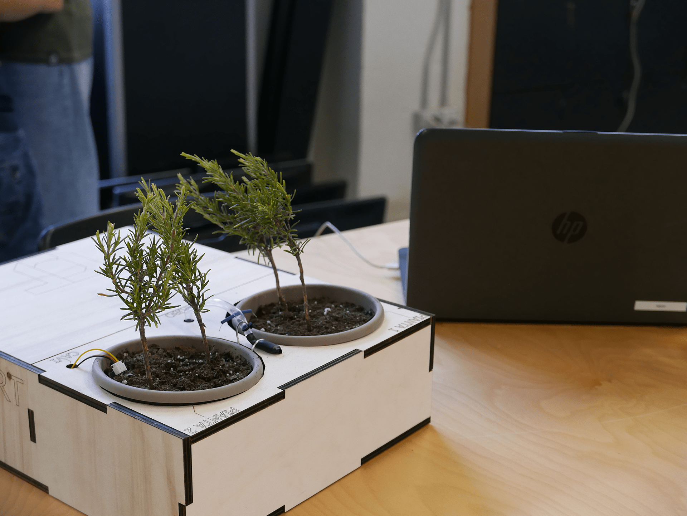

<h1>
	ORTO SMART <a href="https://edu.v-research.it/internships/green_office.html" target="_blank">[EN]</a>
</h1>

## A cosa serve un orto smart negli uffici? 

L'**orto smart** è un progetto **IoT** pensato per salvare i nostri uffici dall'inquinamento e dall'eccessiva urbanizzazione. Vogliamo che le nostre piante crescano forti e **green**, ma non tutti siamo dotati del "pollice verde", per questo automatizzare i nostri prototipi ci è sembrata la soluzione migliore al nostro problema.
In fin dei conti cosa c'è di meglio di un sistema d'irrigazione automatizzato per far sì che le piante siano ogni giorno più belle e rigogliose?

Poi c'è il problema delle ferie: se andiamo in vacanza, come facciamo ad assicurarci che le nostre piantine non muoiano? Il sistema d'irrigazione non è solo automatizzato, ma è anche controllabile da remoto e ci fornisce delle statistiche sull'umidità della terra in tempo reale.

Però si sa, per ogni soluzione c'è un problema. Se da un lato l'**orto smart** sembra perfetto, dall'altro qualcuno potrebbe volerlo hackerare per far morire le nostre piante.
Se dovesse succedere ci potremmo mettere a piangere :'(

Fortunatamente abbiamo pensato di implementare un **sistema sicuro** nel nostro progetto **IoT**! :D

## Cos'abbiamo sviluppato
Il sistema **IoT** colleziona dati (per esempio relativi all'umidità) in un **DataBase** sfruttando tecnologie come **NodeRED** e **Raspberry Pi**.

Più nello specifico,
1. acquisice i dati dai sensori (e.g. umidità) per controllare lo stato di salute delle piante,
2. controlla gli attutatori del sistema di irrigazione
3. permette all'utente di controllare da remoto e in modo super sicuro lo stato del sistema e delle piante.

## Da chi è stato sviluppato?
La cosa più incredibile è chi ha sviluppato i 4 prototipi che sono stati creati durante quest'esperienza educativa: dei ragazzi con età compresa tra i 10 e i 14 anni.

A guidare i ragazzi ci sono stati dei facilitatori:
* Marco Dal Corso - [Fabschool Verona](https://fabschool.it/)
* Giuseppe Giacopuzzi - [Verona FabLab](https://www.veronafablab.it/)
* Mattia Pacchin - [V-Research](https://www.v-research.it/)

## Com'è nato il progetto? - Storia
A giugno 2021 Marco e Mattia di [V-Research](https://www.v-research.it/) hanno visitato una piccola **maker fair** che ha avuto luogo al [311Verona](https://311verona.com/).
Qui, alcuni ragazzi davvero giovani (8-14 anni) hanno presentato i loro fantastici prototipi di sistemi d'irrigazione automatizzati che hanno creato durante un summer camp organizzato dal [Fabschool](https://www.fabschool.it/).

Marco e Mattia sono rimasti impressionati per la passione che i piccoli ingegneri avevano messo nei loro progetto, era incredibile come dei ragazzi così giovani fossero riusciti in sole due settimane ad imparare a programmare il **MicroBit** e a capire come farlo funzionare con dei sensori di umidità, dei led e altro hardware! :o

Da qui è nata la sfida: V-Research voleva costruire un sistema d'irrigazione automatizzato avanzato, e uno degli asset aziendali su cui punta maggiormente è l'[educazione](https://edu.v-research.it).

V-Research ha preso al volo l'opportunità di insegnare a dei giovani promettenti e appassionati come sviluppare un orto smart simile a quello che avevano già fatto, solo che questa volta sono state implementate feature aggiuntive, sono stati utilizzati dispositivi più avanzati e difficili da programmare e i ragazzi hanno anche imparato a modellare in 3D una scatola in legno per poi realizzarla grazie al taglio laser. Vera fantascienza!

## Note finali

Ricordate che le piante sono esseri viventi e che sono nostre amiche! :D

Per maggiori dettagli scrivete un'email a mattia@v-research.it
